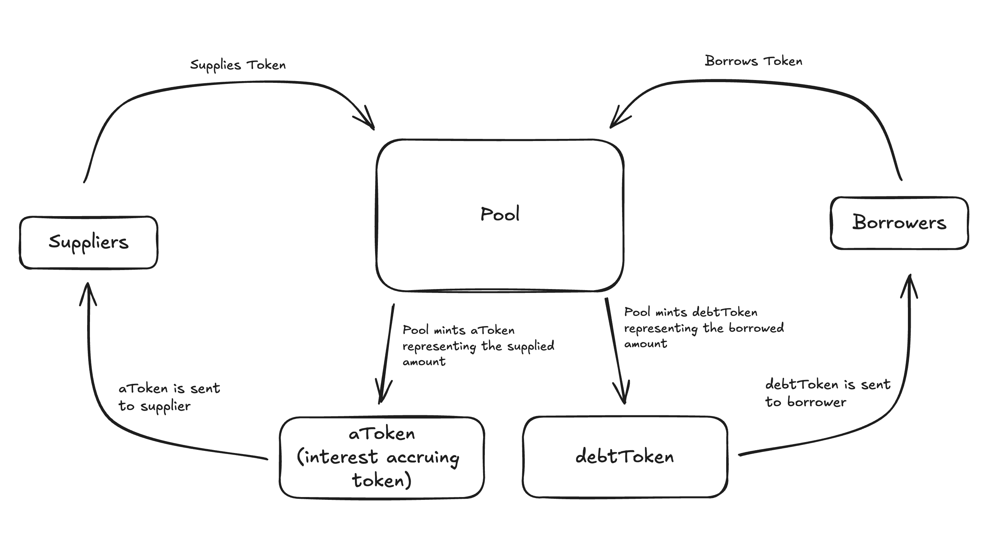
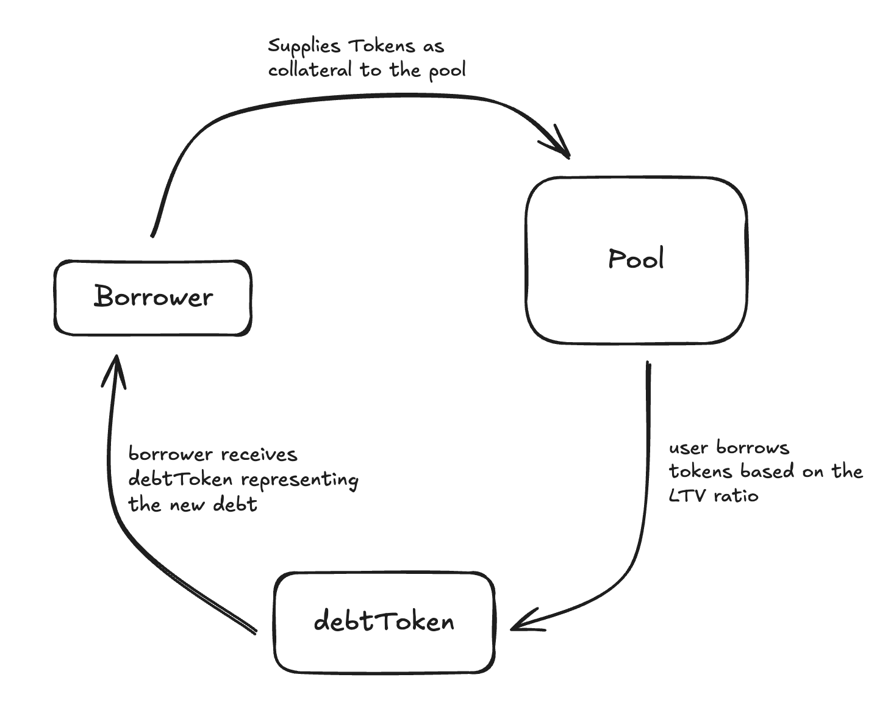

# Architecture

## Smart contracts

Lendfinity's architecture comprises primarily of several interconnected smart contracts, these contracts are grouped into 3 categories:

* Configuration - Manages key settings, access control, and contract addresses
* Pool logic - Governs the core lending and borrowing mechanics
* Tokenization - Handles tokenized representations of deposits and debts

### Configuration

**ACLManager**

This contract is responsible for managing access control throughout the Lendfinity protocol. It defines roles and permissions to ensure only authorised addresses can execute certain operations, safeguarding the protocol’s integrity.

**PoolAddressesProvider**

This contract manages key addresses in the protocol. It stores references to contracts like the Pool, Price Oracle, and others.

### Pool logic

**Pool**

The core contract for lending operations. It facilitates actions like deposits, withdrawals, borrowings and repayments. It manages interactions between users and the lending pool

**PoolConfigurator**

This contract manages pool settings. It allows admins to updates parameters like interest rates, collateral requirements and asset listings.

### Tokenization

**aToken**

A tokenized representation of user deposits. When users deposit assets into the pool, they receive an equivilent amount of aToken, which accrues interest over time. It serves as both proof of deposit and for tracking interest accrual.

**StableDebtToken**

This contract represents users debt in the form of stable rate borrowing. When users opt for a stable interest rate loan, this token tracks their outstanding loan balance.

**VariableDebtToken**

Similar to the StableDebtToken, but this tracks loans with variable interest rates. It allows users to borrow with a rate that adjusts based on market conditions.

## User flows

In Lendfinity, the interaction between suppliers and borrowers is facilitated through the **Pool** contract, which manages the flow of tokens and the minting of interest-bearing and debt tokens.

Here's an overview of the user flow:

#### Supplier Flow:

1. **Supplies Token**: Users (Suppliers) deposit their tokens into the Pool.
2. **Receives aToken**: The Pool mints an interest-bearing token (aToken) equivalent to the amount supplied, representing the user’s share in the Pool. This token accrues interest over time, reflecting the supplier's earnings.
3. **Accruing Interest**: As the Pool generates revenue from loans, the value of the aToken increases, providing the supplier with passive income.

#### Borrower Flow:

1. **Borrows Token**: Users (Borrowers) can borrow assets from the Pool by providing collateral.
2. **Receives debtToken**: The Pool mints a debt token, representing the borrower's debt obligation. Depending on the loan type, the borrower may receive either a StableDebtToken or a VariableDebtToken.
3. **Repaying Loan**: When the borrower repays the loan, the debtToken is burned, settling the debt.

<figure><figcaption></figcaption></figure>

#### Collateralization Flow:

Borrowers must provide collateral to secure loans. This process ensures that the protocol remains solvent and reduces the risk of bad debt. Below is an overview of how the collateralization flow works:

1. **Depositing Collateral**: Before borrowing, users must deposit collateral into the Pool. The type and amount of collateral required are determined by the protocol's parameters (such as LTV ratios).
2. **Borrowing Against Collateral**: Based on the value of the deposited collateral, borrowers can take out loans up to a certain percentage of the collateral's value, known as the **LTV (Loan-to-Value)** ratio. If the LTV ratio is exceeded, users may face liquidation risks.
3. **Accruing Interest**: Borrowers incur interest on the borrowed amount, which is calculated based on the type of debt (stable or variable).
4. **Collateral Monitoring**: The system continuously monitors the value of the borrower’s collateral. If the value of the collateral drops below the liquidation threshold, the borrower’s collateral is subject to liquidation.
5. **Loan Repayment and Withdrawal**: Once the loan is repaid, the borrower can withdraw the collateral that was used to secure the loan. If the borrower repays early, they only pay interest accrued during the borrowing period.

<figure><figcaption></figcaption></figure>

